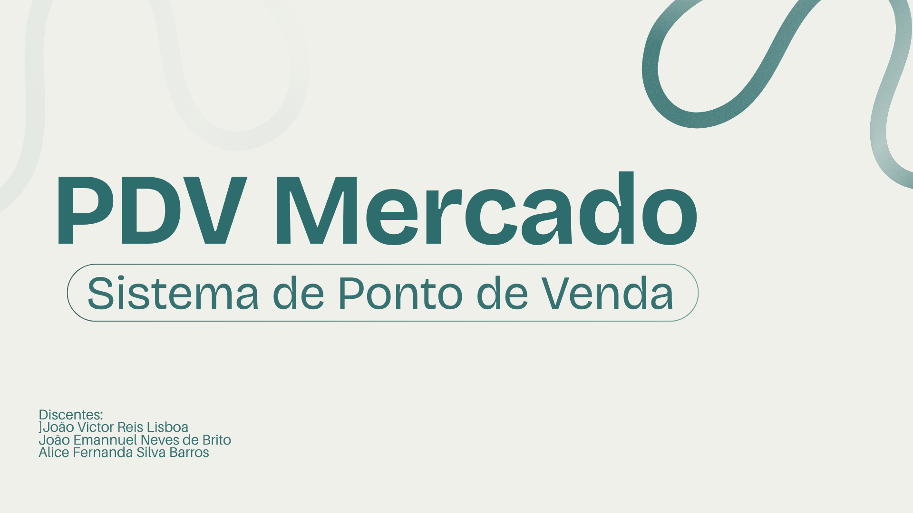

# Projeto Final — Programação de Computadores II (2026.2)



Sistema de **caixa/mercado (PDV)** em Java, desenvolvido em console, aplicando os conceitos de Programação Orientada a Objetos trabalhados na disciplina: herança, interfaces, encapsulamento e composição entre classes.

O sistema simula o dia a dia de um pequeno mercado: gerentes cadastram produtos e funcionários, e operadores de caixa realizam vendas, aplicam descontos, processam pagamentos e emitem recibos, com baixa automática de estoque.

## Como compilar e executar

Com o java instalado, abra o terminal na pasta `PDVMercado` e execute (utilize o Git Bash no Windows):

```bash
mkdir -p bin
javac -encoding UTF-8 -d bin $(find src -name "*.java")
java -cp bin mercado.app.Main
```

Ou execute o script:

```bash
bash executar.sh
```

## Funcionalidades

### Gerente
— Cadastrar novos operadores de caixa  
— Cadastrar produtos  
— Adicionar ou baixar estoque de um produto  
— Listar produtos cadastrados  
— Verificar estoque total  
— Emitir relatório de vendas  
— Alterar a própria senha  

### Operador de Caixa
— Iniciar uma nova venda  
— Registrar itens no carrinho (com validação de estoque disponível)  
— Remover itens do carrinho  
— Aplicar desconto na venda  
— Registrar pagamento (Cartão de Crédito/Débito, Pix ou Dinheiro, com cálculo de troco)  
— Emitir recibo  
— Finalizar a venda, com baixa automática do estoque dos itens vendidos  

## Estrutura do projeto

```
src/
└── mercado/
    ├── app/
    │   ├── Main.java
    │   └── DadosDemo.java
    ├── menu/
    │   ├── Menu.java
    │   └── Utilitarios.java
    ├── modelo/
    │   ├── Produto.java
    │   ├── Empresa.java
    │   ├── Carrinho.java
    │   ├── ItemCarrinho.java
    │   └── Venda.java
    ├── usuario/
    │   ├── Usuario.java
    │   ├── Gerente.java
    │   └── OperadorCaixa.java
    └── pagamento/
        ├── FormaPagamento.java
        ├── Pagamento.java
        ├── Cartao.java
        ├── Pix.java
        └── Dinheiro.java
```

## Modelagem (POO)

— **Herança:** `Gerente` e `OperadorCaixa` estendem a classe abstrata `Usuario`, compartilhando dados de login (nome, CPF, senha) e especializando o comportamento de cada perfil.  
— **Interface e polimorfismo:** `FormaPagamento` define o contrato `realizarPagamento(Pagamento)`, implementado de forma distinta por `Cartao`, `Pix` e `Dinheiro`.  
— **Composição:** `Venda` é composta por um `Carrinho`, que por sua vez agrega vários `ItemCarrinho`; `Empresa` mantém a lista de `Produto` disponíveis para venda.  

## Usuários de demonstração

O sistema já inicia com dois usuários e cinco produtos cadastrados, para facilitar os testes:

| Perfil    | CPF           | Senha      |
|-----------|---------------|------------|
| Gerente   | 00000000000   | admin      |
| Operador  | 22222222222   | senha123   |

## Fluxo básico de uso

1. Faça login como **Gerente** ou **Operador de Caixa**.
2. Como gerente: cadastre produtos/funcionários ou acompanhe o estoque e as vendas.
3. Como operador: inicie uma venda, adicione produtos ao carrinho, aplique desconto (se houver), registre o pagamento e finalize a venda — o estoque é atualizado automaticamente.

## Diagramas utilizados
Os diagramas desenvolvidos ao decorrer do projeto estão disponíveis na pasta `diagramas\`:
* `diagramas/Diagrama_Sequencia_Venda.png`;
* `diagramas/diagrama_caso_de_uso.png`;
* `diagramas/diagrama_de_atividades.drawio.png`;
